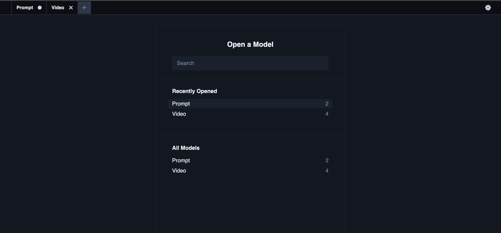
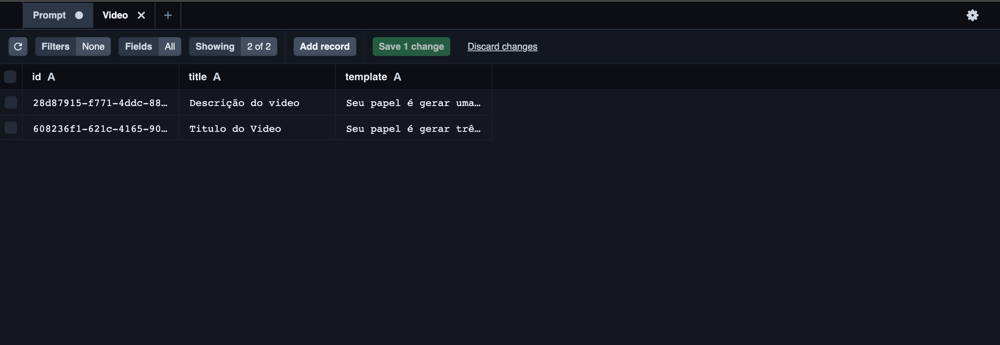
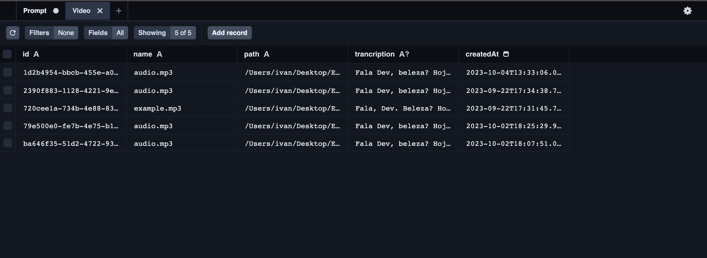

<!-- inicializando com  --> pnpm run dev
<!-- Visualizar banco de dados --> pnpm prisma studio

<h1 align="center"> UPLOAD IA API </h1>

Desenvolvido por Ivan Barbosa em conjunto com a Rocktseat 
Veja o video do projeto <a href="https://www.linkedin.com/posts/ivanbarbosa2_rocketseat-rocketseat-reactjs-activity-7115362398164688896-jAYR?utm_source=share&utm_medium=member_desktop">CLICANDO AQUI!</a>  

  
  
  

 

## 💻 Projeto

- Desenvolvido um banco de dados para fazer a integração e manipulação entre front e api. Que recebe um video e interagindo com a API do chatgpt gera títulos, hashtags, e um resumo, do conteúdo do video.

## 🚀 Tecnologias

Esse projeto foi desenvolvido com as seguintes tecnologias:

- Node.js
- JavaScript
- TypeScript

## 🔖 Dependências

- Node.js v20.6.*
- Prisma 5.3.*
- Ai 2.2.14
- Fastify 4.23.1
- Openai 4.7.1
- Zod 3.22.2

## 💻 Clone e acesse o projeto
------------
    `https://github.com/ivanbs14/Upload_AI_API.git`

    or 

    `gh repo clone ivanbs14/Upload_AI_API`

## 💻 Configurar e executar cliente
------------
Acesse a pasta do cliente:

`cd upload_ai_api/`

Agora, instale e execute seu aplicativo

se ja tiver o node instalado na sua máquina:
 

`npm install -g pnpm`

`pnpm init`

`npm run dev` ---    execute servidor  --- 

`pnpm prisma studio` ---    execute Prisma web  ---

Verifique se o servidor esta em execução no local: http://localhost:3333/  (este endereço acima pode variar)

## Qualquer dúvida, envie um e-mail para

`ivanbarbosab@gmail.com`

---
